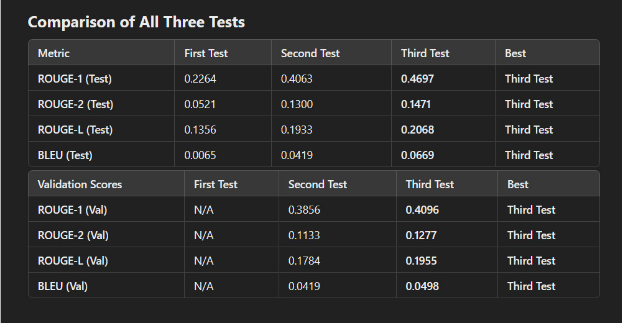
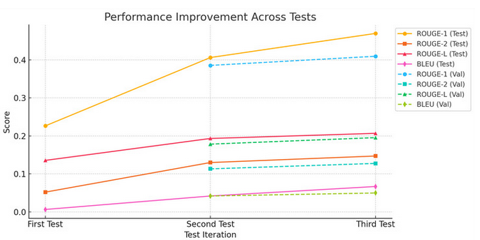
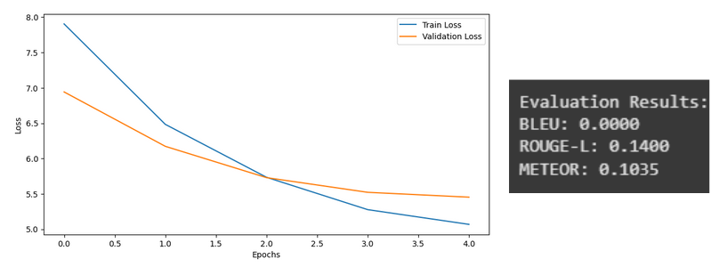
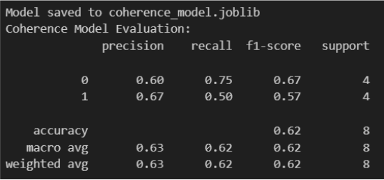
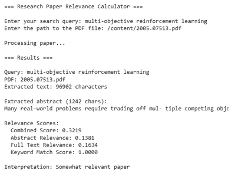

# Research Paper Optimizer

With the Research Paper Optimizer, our aim was to provide support to develop a research paper. Researchers may face challenges in publishing due to not adhering to the expected industry standards. Our objective is to decrease the challenges faced by the researchers (new or experienced) by providing multiple tools for different aspects of the papers, as listed below:
### Features:
- Quality Assurance Checks: Provide users with a report of the determined quality of their input paper by:
  - Coherence and relevance checks
  - Plagiarism detection
  - Citation Validation
- Generative Models: 
  - Generate an abstract
  - Generate captions for images
 
### Using the App:
Deployed as a Streamlit Web Application, this project can be easily accessed via [this link](https://research-paper-optimizer.streamlit.app/). 
First, upload your draft research paper in PDF form via the 'Browse Files' button in the side panel. Once the paper has been uploaded and processed, you can use any of the tools via the tabs present along the top.
1. Abstract Generator:
Get a recommended abstract generated that is tailored to the content of your research paper.
2. Image Caption Generator:
This tool detects and extracts images from your paper and generates suitable captions.
3. Citation Validator:
Use the Citation Validator to make sure that your paper's citations adhere to the proper formatting guidelines and are properly referenced within the body of the paper.
4. Quality Assurance:
This tool can let you know if there are any logical inconsistencies in your paper's content. Good quality writing is essential for publications, and this tool helps with that.
5. Relevance Checker:
While referring to existing papers, it can become tedious to go through several papers to determine whether they are relevant to your topic. This tool helps you to quickly determine whether a paper can be used, lessening the amount of time spent on irrelevant papers.
Refer to the demonstration video [here](https://drive.google.com/file/d/10ADBUAfJQ9MH-tGHNOiHiqYKVlnluI0o/view?usp=drive_link) to check how the tool works.
---
## About the Project
### Dataset:
The models used in this project were trained on a dataset of [DeepMind Research Papers](https://www.kaggle.com/datasets/ppb00x/deepmind-research-papers) found on Kaggle. The dataset being only research papers on artificial intelligence and related fields limits the scope of our project to only those fields. However, if trained on a larger variety of papers, the project can be useful for other fields as well. 
### Results:
Abstract Generator Evaluation Results and Graphical Comparison:  
  
  

Image Captioning Training Curve and Evaluation Scores:  
  

Coherence Model Evaluation Scores:  
  

Relevance Checker Evaluation Scores:  
  

### Future Scope:
The image captioning model had a lower accuracy than what was anticipated. This can be improved by using a more robust dataset of scientific figures, like the SciCap dataset.

---
## Credits
This project was developed in collaboration with my teammates [Srinivas Kulkarni](https://github.com/srii18) and [B N Rushitha](https://github.com/BN-Rushitha). Huge thanks to them for working with me to make this project a reality.
I am also happy to share that this project won the position of First Runner-Up at the TechSaksham Regional Showcase, conducted by the Edunet Foundation in collaboration with Microsoft, SAP. 

## Project Documentation
Streamlit App Link: https://research-paper-optimizer.streamlit.app/  
Report: https://docs.google.com/document/d/1WzcIH99WBy7MG6QX0TXR-QTIU_daOcR7/edit?usp=drive_link&ouid=114549504856296588089&rtpof=true&sd=true

